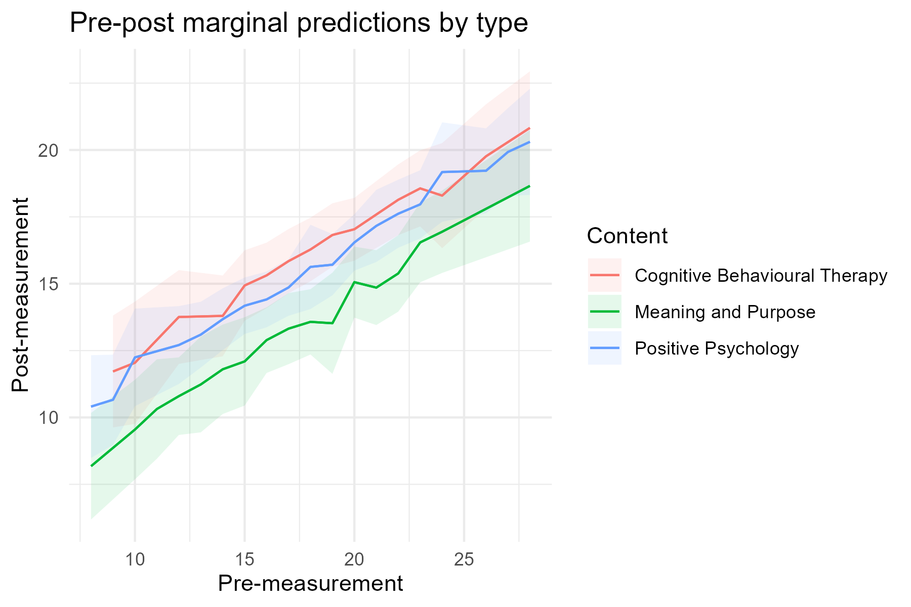

# Engage model

Code accompanying a consult we did for analysing the effect of an online computer therapy on different psychological measures, and additionally the effect of engagement on this.

In this R code project, we're showing how to do data transformation from long to wide, fit several different models, and visualize and interpret the models.

## Contact
This code was made by the [ODISSEI Social Data Science (SoDa)](https://odissei-data.nl/nl/soda/) team.
Do you have questions, suggestions, or remarks on the technical implementation? Contact us on our website!

 